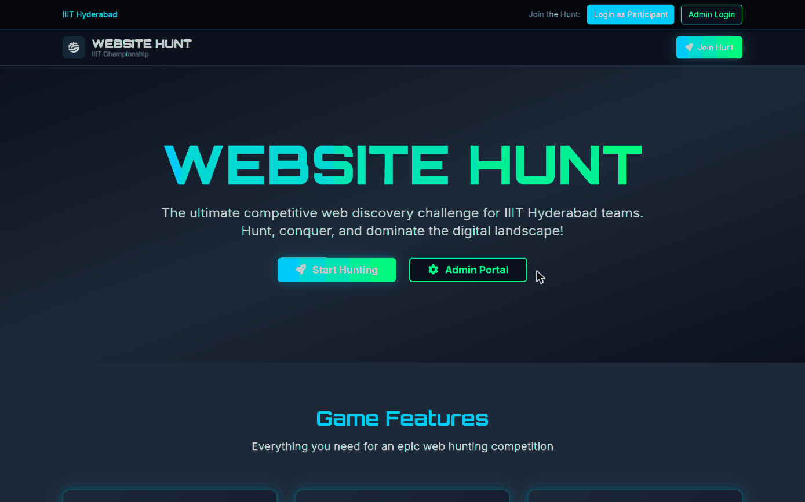
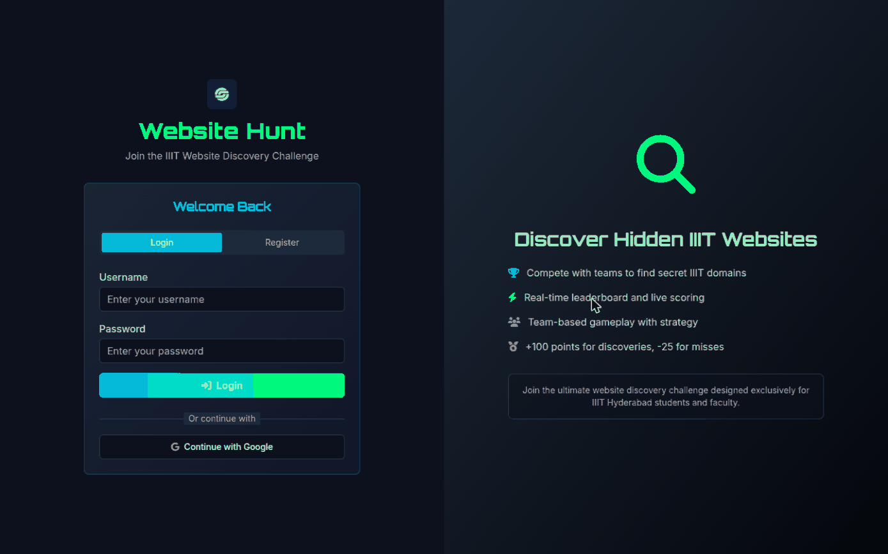
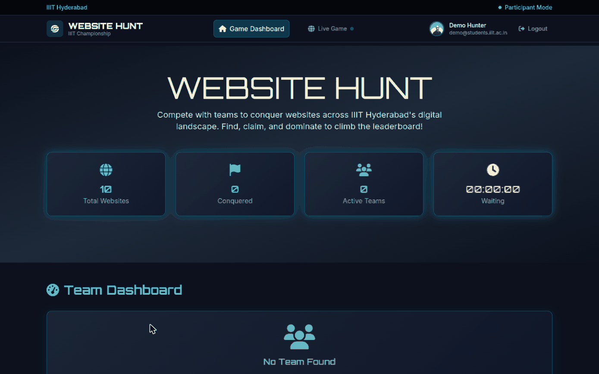
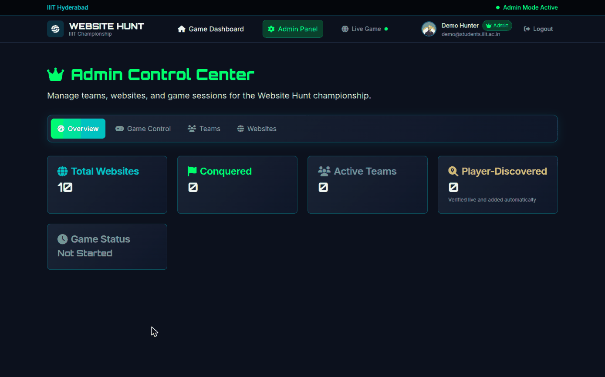

<div align="center">

<picture>
  <source media="(prefers-color-scheme: dark)" srcset="./docs/assets/adk_dev_logo_light.png">
  
</picture>

# Website Hunt

**A team competition for IIIT Hyderabad: teams race to find and claim websites across the campus's domains, scoring points for every site they are first to reach.**


<br>


<br><br>

**[Developer documentation](./DEVDOC.md)** · [Features](#features) · [Getting started](#getting-started)

</div>

---

An admin seeds a list of target sites and runs the clock. Teams submit URLs; the first
team to submit a given site claims it. Because nobody can list every site on campus, a
submission for a site that is not on the list is checked live, and counts if it is real.

## Contents

- [Why this project matters](#why-this-project-matters)
- [Screenshots](#screenshots)
- [Features](#features)
- [Roles](#roles)
- [The game lifecycle](#the-game-lifecycle)
- [A typical run](#a-typical-run)
- [Tech stack](#tech-stack)
- [Getting started](#getting-started)
- [Contributors](#contributors)
- [License](#license)

---

## Why this project matters

The hard part of a scavenger hunt for websites is that **the answer list cannot be
complete**. Nobody knows every hostname under `iiit.ac.in`, so a hunt scored purely
against a fixed list punishes the teams who are actually good at the game: they find a
real site nobody thought of and get nothing for it.

So a submission that is not on the list is resolved live and counted if it exists. That
turns the scoring problem into a URL identity problem, which is where the real work is:
`students.iiit.ac.in`, `https://students.iiit.ac.in/`, `HTTPS://Students.IIIT.ac.in` and
`students.iiit.ac.in/index.html` are one site, and the client and the server have to agree
on that or a team gets charged for a duplicate. The normalisation rules live in
`shared/url.ts` precisely so both ends use the same code.

The second constraint is the venue. This runs at a campus event on a LAN, often with no
route to the internet, which is why every font and icon is bundled into the image rather
than pulled from a CDN.

## Screenshots

Real 1440x900 viewport renders against a seeded instance. **The app ships a single dark
theme**, so unlike the other projects in this account there is no light gallery and no
`README-light.md` to toggle to.

<table>
  <tr>
    <td width="50%" valign="top">
      
      <p align="center"><b>Landing</b><br><sub>Where a team starts, before anyone has an account.</sub></p>
    </td>
    <td width="50%" valign="top">
      
      <p align="center"><b>Sign in</b><br><sub>Register or log in, with the scoring rules alongside.</sub></p>
    </td>
  </tr>
  <tr>
    <td width="50%" valign="top">
      
      <p align="center"><b>Participant</b><br><sub>Live counts, the clock, and your team's standing.</sub></p>
    </td>
    <td width="50%" valign="top">
      
      <p align="center"><b>Admin</b><br><sub>Run the clock, manage teams, and see discovered sites.</sub></p>
    </td>
  </tr>
</table>

## Features

### Submitting a site
- Type a URL in any shape. `  HTTPS://Students.IIIT.ac.in/  `, `students.iiit.ac.in`
  and `www.students.iiit.ac.in/#about` are all the same target: leading and trailing
  spaces, spaces *inside* the address, capitals, `http`/`https`, a `www.` prefix, a
  trailing slash, a port, a query string and a fragment are all ignored before matching.
- The form shows the canonical form it will submit, before you submit it.
- Deep links count. If the admin listed `cvit.iiit.ac.in` and you submit
  `cvit.iiit.ac.in/projects/2024`, you have still found the site.

### Sites nobody listed
- A guess for an `iiit.ac.in` site that is not on the list is verified live. If it
  answers, it joins the hunt and scores full points, and is flagged in the admin panel
  as player-discovered.
- This is the point of the game: the list is a starting set, not the whole map.

### Scoring
| Outcome | Points | When |
|---|---|---|
| Conquered | + the site's value (default 100) | You were first to a real, unclaimed site |
| Already done | 0 | Your team already claimed it - no penalty for resubmitting |
| Already taken | 0 | Another team got there first. You are told **which team** |
| Already tried | 0 | You already guessed this exact URL and it was wrong. Never charged twice |
| Could not verify | 0 | We could not reach it. Costs nothing either way |
| Wrong | -25 | Provably wrong: not an `iiit.ac.in` domain |

The rule behind the table: points are only deducted for a guess that can be *proven*
wrong. Anything uncertain scores zero rather than risking a penalty for a correct answer.

### Anti-spam
- One submission per team every 2 seconds, enforced on the server. The submit button
  shows the remaining wait, so a double-click or a held Enter key cannot drain a score.
- Resubmitting anything already settled is always free.

### Live updates
- Leaderboard, recent activity and stats update over a websocket as other teams play.
- The countdown ticks in real time and the game ends by itself when the clock runs out.

## Roles

| Role | Can do |
|---|---|
| **Player** | Join a team, submit URLs, see the leaderboard and their team's history |
| **Admin** | Everything a player can, plus: create teams, add sites in bulk, start / pause / resume / end the game, and see game stats |

## The game lifecycle

```
no game  ->  active  ->  paused  ->  active  ->  ended
                 |                                 ^
                 +---------- clock runs out -------+
```

Submissions are only accepted while a game is `active`. Starting a new game
automatically ends any previous one, so only one hunt runs at a time.

## A typical run

1. Admin signs in and adds target sites, one URL per line, in **Websites**.
2. Admin creates teams in **Teams**, picking members from registered users.
3. Admin sets a duration and presses **Start New Game**.
4. Players sign in, find their team dashboard, and start submitting.
5. The game ends when the admin ends it or the clock expires. The leaderboard is final.

## Tech stack

React 19 + Vite 8 + Tailwind on the client, Express 5 + Drizzle ORM + PostgreSQL on the
server, with a websocket for live updates. TypeScript throughout, sharing the URL
normalization rules between client and server so both judge a URL identically.

## Getting started

```bash
cp .env.example .env      # fill in DATABASE_URL, SESSION_SECRET and ADMIN_PASSWORD
docker compose up -d
```

First boot needs `SEED_DATABASE=true` and an `ADMIN_PASSWORD` in `.env` to create the
admin account, which is the only way into the admin panel.

Or without Docker, against a Postgres you already have:

```bash
npm install
cp .env.example .env      # fill in DATABASE_URL and SESSION_SECRET
npm run db:push
npm run db:seed           # creates the admin and the starter website list
npm run dev               # http://localhost:5000
```

`npm run dev` and `npm run db:seed` read `.env` directly (Node's
`--env-file-if-exists`), so the same file works for both the Docker and the
non-Docker route. Requires **Node 22.9 or newer** for that flag.

More detail is in [DEVDOC.md](./DEVDOC.md).

## Contributors

<table>
  <tr>
    <td align="center">
      <a href="https://github.com/Dileepadari">
        
        <br><sub><b>Dileep Adari</b></sub>
      </a>
      <br><sub>Author and maintainer</sub>
    </td>
  </tr>
</table>

## License

MIT. See [LICENSE](./LICENSE).
